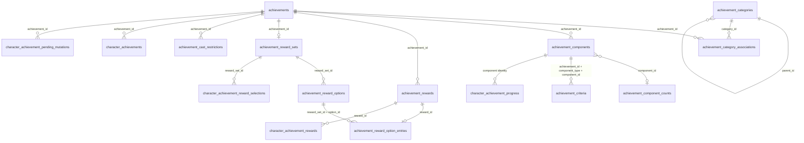

# Achievement content authoring

This guide covers database content, evaluation policy, and rewards for the
achievement system. See [RoF2 achievement support](achievements.md) for runtime
flow, client packets, import behavior, and operational details.
The [RoF2 / Dragons of Norrath coverage audit](achievement_coverage.md) records
the exact trigger ownership and intentionally disabled resource definitions.

Achievement definitions are content. Character progress and reward ledgers are
runtime state. Keep those concerns separate:

- The content database holds categories, definitions, components, criteria,
  rewards, and spell restrictions.
- The character database holds completion, component progress, and reward
  delivery state.
- A server that does not split content and character data may place both groups
  in one schema, but the ownership rules are unchanged.

The schema deliberately has no SQL foreign keys. The zone process loads a
complete snapshot and rejects missing, conflicting, or ambiguous relationships.

## Relationships



The character tables also link `character_id` to `character_data.id`.

## Stable identities

Treat these values as durable API:

- An achievement is identified by `achievements.id`.
- A component is identified by
  `(achievement_id, component_type, component_id)`.
- A criterion is unique by
  `(achievement_id, component_type, component_id, event_type, target_id,
  target_id2)`.
- A grant is identified by `achievement_rewards.reward_id`.
- A selectable reward is identified by `achievement_reward_sets.reward_set_id`
  and an option by `(reward_set_id, option_id)`.

`sequence` controls presentation order. It is not a substitute for any of
these identities.

`component_type` and `event_type` are unrelated:

- `component_type` chooses a RoF2 definition/state bucket. Types `0`, `1`, and
  `2` can hold server state; type `3` is presentation-only.
- `event_type` tells the server which game event evaluates a criterion.

Author new evaluated components with a state-bearing component type. Do not
attach an enabled criterion to component type `3`.

## Content tables

### `achievement_categories`

Categories form the tree in the left side of the achievement window.

| Field | Meaning |
| --- | --- |
| `id` | Stable category ID and primary key. |
| `parent_id` | Parent category ID. Use `0` for a root. |
| `sequence` | Sort order among siblings. Ties are ordered by `id`. |
| `name` | Visible category name. |
| `description` | Category description sent to the client. |
| `icon` | Client texture or resource name, such as `A_Hunter`. An empty value produces text-only presentation. |

Only categories containing an enabled association, and their ancestors, are
sent to the client.

### `achievements`

This is the top-level definition record.

| Field | Meaning |
| --- | --- |
| `id` | Stable achievement ID and primary key. |
| `name` | Visible achievement name and default link text. |
| `description` | Visible achievement description. |
| `icon_id` | Numeric client icon ID. |
| `points` | Score awarded for completing the achievement. |
| `reward_display` | Imported client presentation field. At load time the server replaces it with `1` only when a valid server-authored reward or reward set exists. |
| `world_display_flag` | Newer-client styling field retained with imported data. RoF2 does not receive it. |
| `definition_version` | Nonzero version copied into character completion and progress. Increment it when a deployed definition changes incompatibly. |
| `reset_on_version_change` | When `1`, a version mismatch removes that character's old completion, progress, reward ledger, and selection ledger before rebuilding state. |
| `enabled` | `1` loads the definition; `0` excludes it from the active snapshot. |

Every enabled achievement must have at least one valid category association.

### `achievement_category_associations`

This join table places an achievement in a category.

| Field | Meaning |
| --- | --- |
| `category_id` | Logical reference to `achievement_categories.id`. |
| `sequence` | Achievement order within the category. |
| `achievement_id` | Logical reference to `achievements.id`. |
| `display_text` | Association-specific client text. Leave empty to use the normal definition presentation. |

The primary key is `(category_id, achievement_id)`. One achievement may appear
in more than one category.

### `achievement_components`

Components are the visible steps inside an achievement.

| Field | Meaning |
| --- | --- |
| `achievement_id` | Logical reference to `achievements.id`. |
| `component_type` | RoF2 component bucket `0` through `3`. Only `0` through `2` carry server-evaluated state. |
| `sequence` | Display order within the component type. The wire display order is clamped to `255`. |
| `component_id` | Stable component ID. It is part of the component identity. |
| `description` | Primary visible step text. |
| `description_2` | Secondary client text; use an empty string when it is not needed. |

The primary key is `(achievement_id, component_type, component_id)`.

### `achievement_component_counts`

This table supplies the presentation count imported from client resources.

| Field | Meaning |
| --- | --- |
| `component_id` | Component ID and primary key. Component IDs sharing this value also share this presentation default. |
| `required_count` | Default count displayed when no enabled criterion overrides it. Values below `1` are treated as `1`. |

For an evaluated component, the enabled criterion's explicit
`required_count` is authoritative for both server evaluation and the definition
sent to RoF2.

### `achievement_criteria`

Criteria connect visible components to server events.

| Field | Meaning |
| --- | --- |
| `id` | Auto-incremented row identity used for diagnostics. |
| `achievement_id` | Logical reference to `achievements.id`. |
| `component_type` | Must match the target component and be `0`, `1`, or `2`. |
| `component_sequence` | Authoring copy of the component's display sequence. Keep it synchronized for readable exports; it is not runtime identity. |
| `component_id` | Must match the target component. |
| `event_type` | Event selector described in [Event types](#event-types). |
| `progress_mode` | How an observed event value changes progress. |
| `behavior` | How this component affects visibility, locking, and completion. |
| `target_id` | Primary event filter. Its meaning depends on `event_type`. |
| `target_id2` | Secondary event filter. Supported only by NPC-name kills, owned items, and skill caps. |
| `target_value` | Minimum observed value, except that skill caps use it as the milestone level. It must not be negative. |
| `required_count` | Nonzero count needed to satisfy the component. This overrides `achievement_component_counts`. |
| `enabled` | `1` loads the criterion; `0` leaves the row available for later use. |

All enabled criteria for one component must use the same `event_type`,
`progress_mode`, `behavior`, and effective `required_count`. Multiple target
rows are alternatives for that component; the highest valid candidate wins.

### `achievement_cast_restrictions`

This table extends existing spell restriction IDs with achievement state.

| Field | Meaning |
| --- | --- |
| `restriction_id` | Existing spell restriction number. |
| `achievement_id` | Required enabled achievement. |
| `requires_completed` | `1` requires completion; `0` requires the achievement to remain incomplete. |

All rows with the same `restriction_id` must pass. The primary key is
`(restriction_id, achievement_id)`.

## Reward content tables

### `achievement_rewards`

Each row is one independently guarded grant.

| Field | Meaning |
| --- | --- |
| `reward_id` | Auto-incremented grant identity. Enabled values must be nonzero and fit in an unsigned 32-bit RoF2 wire field. |
| `achievement_id` | Achievement that owns the grant. |
| `sequence` | Display and automatic-grant order. It is unique within the achievement. |
| `reward_type` | Grant type described in [Reward types](#reward-types). |
| `reward_data_id` | Type-specific item, currency, title-set, or experience-mode value. |
| `amount` | Positive type-specific quantity. |
| `description` | Text shown in the reward preview. The server supplies a fallback for an empty description. |
| `enabled` | `1` loads the grant. A disabled mapped row stays mapped and cannot fall back to an automatic grant. |

An enabled row absent from `achievement_reward_option_entries` is granted
automatically at completion. A mapped row belongs to a common or selectable
option instead.

### `achievement_reward_sets`

An achievement may have one selectable reward set.

| Field | Meaning |
| --- | --- |
| `reward_set_id` | Stable nonzero set ID and primary key. |
| `achievement_id` | Owning achievement. This column is unique. |
| `title` | Select Reward window title. An empty value falls back to the achievement name. |
| `enabled` | `1` loads the set and its enabled options. |

### `achievement_reward_options`

Options define the common and selectable groups in a reward set.

| Field | Meaning |
| --- | --- |
| `reward_set_id` | Logical reference to `achievement_reward_sets.reward_set_id`. |
| `option_id` | Stable nonzero option ID within the set. |
| `sequence` | Display order. |
| `label` | Text in the reward choices list. |
| `common_to_all` | `1` grants this option with every selection; `0` makes it selectable. |
| `flags` | RoF2 option flags passed to the reward window. Use `0` unless a verified client behavior requires another value. |
| `enabled` | `1` loads the option. |

The primary key is `(reward_set_id, option_id)`. Every enabled set must contain
at least one enabled, non-common option, and every loaded option must contain at
least one enabled grant.

### `achievement_reward_option_entries`

This table assigns canonical grants to options.

| Field | Meaning |
| --- | --- |
| `reward_set_id` | Reward set containing the option. |
| `option_id` | Option receiving the grant. |
| `reward_id` | Logical reference to `achievement_rewards.reward_id`. A grant may appear in only one option. |

The primary key is `(reward_set_id, option_id, reward_id)`.

## Character state tables

These tables are server-owned runtime state. Content migrations and quest
scripts should not write them directly.

### `character_achievement_pending_mutations`

This durable queue carries scripted updates to players outside the source zone.
World resolves a character, group, raid, dynamic-zone, or shared-task target
into one row per player. A target zone deletes a row only after the requested
state is already satisfied or its persistence succeeds.

| Field | Meaning |
| --- | --- |
| `mutation_id` | Auto-incremented queue identity and primary key. |
| `character_id` | Character that must consume this mutation. |
| `source_target_type` | Original scope: `0` character, `1` group, `2` raid, `3` dynamic zone, or `4` shared-task instance. |
| `source_target_id` | Original character, group, raid, dynamic-zone, or shared-task instance ID. It is retained for diagnostics. |
| `operation` | `0` advances a component to at least `requested_value`; `1` completes the whole achievement. |
| `achievement_id` | Target achievement. |
| `component_type` | State-bearing component type for an advance; `0` for whole completion. |
| `component_id` | Authored component identity for an advance, where `0` is valid; `0` is also carried for whole completion and is disambiguated by `operation`. |
| `requested_value` | Monotonic progress floor for an advance, clamped to the component's required count; `0` for whole completion. |
| `definition_version` | Source zone's active definition version. A target using another version blocks the row rather than applying it to changed content. |
| `status` | `0` pending, `1` blocked by invalid or incompatible content, or `2` processing under a target-zone lease. |
| `attempt_count` | Number of application claims. Its incremented value is also the compare-and-swap ownership token for the current attempt. |
| `created_at` | Database Unix timestamp when world committed the per-character row. |
| `last_attempt_at` | Database Unix timestamp when the current or latest application claim began, otherwise `0`. |
| `last_error` | Most recent blocked or retryable diagnostic. |

Blocked rows remain available for diagnosis and are reconsidered when the
character state is rebuilt, such as login or achievement reload. Do not turn
them into direct progress rows by hand; correct the content or discard the
authored request explicitly. Processing rows use a 60-second lease. A zone
process that stops while holding one does not strand it: world wakes the
character after the lease expires, and the next target zone can claim it.

Queued requests always require an exact match between the source definition
version and the target zone's loaded definition version. This guard applies
whether or not `reset_on_version_change` is enabled. The reset flag separately
controls what happens to already-persisted character state when content is
loaded at a newer version.

### `character_achievements`

| Field | Meaning |
| --- | --- |
| `character_id` | Logical reference to `character_data.id`. |
| `achievement_id` | Completed achievement. |
| `definition_version` | Definition version in force when completion was persisted. |
| `completed_at` | Unix completion timestamp. |

The primary key `(character_id, achievement_id)` prevents duplicate completion.

### `character_achievement_progress`

| Field | Meaning |
| --- | --- |
| `character_id` | Character owning the progress. |
| `achievement_id` | Owning achievement. |
| `component_type` | State-bearing component bucket. |
| `component_sequence` | Current presentation sequence copied for diagnostics and updates; not identity. |
| `component_id` | Stable component ID. |
| `current_count` | Durable, clamped progress count. |
| `completed` | Materialized component-satisfied flag. |
| `definition_version` | Definition version under which this progress was written. |
| `updated_at` | Unix timestamp of the last durable update. |

The primary key is
`(character_id, achievement_id, component_type, component_id)`.

### `character_achievement_rewards`

This is the idempotency ledger for each individual grant.

| Field | Meaning |
| --- | --- |
| `character_id` | Character receiving the grant. |
| `achievement_id` | Achievement that produced it. |
| `reward_id` | Canonical `achievement_rewards.reward_id`. |
| `status` | `0` claimed/in flight, `1` durably granted, or `2` explicit retryable delivery failure. |
| `attempt_count` | Number of delivery claims started. |
| `granted_at` | Unix timestamp of successful delivery, otherwise `0`. |
| `last_attempt_at` | Unix timestamp of the latest attempt. |
| `last_error` | Last delivery or persistence diagnostic. |

The primary key `(character_id, achievement_id, reward_id)` is the
at-most-once boundary. Do not retry status `0` automatically after an ambiguous
interruption.

### `character_achievement_reward_selections`

This table tracks one whole selectable claim.

| Field | Meaning |
| --- | --- |
| `character_id` | Character owning the pending or completed selection. |
| `achievement_id` | Completed achievement that produced the set. |
| `reward_set_id` | Authored reward set. |
| `selected_option_id` | `0` before a choice; otherwise the locked selected option. |
| `status` | `0` pending/in progress, `1` fully granted, `2` explicit retryable failure, or `3` ambiguous delivery. |
| `attempt_count` | Number of whole-selection attempts. |
| `claimed_at` | Unix timestamp when every entry was finalized. |
| `last_attempt_at` | Unix timestamp of the latest selection attempt. |
| `last_error` | Last selection-level diagnostic. |

The primary key is `(character_id, achievement_id, reward_set_id)`. Individual
entries remain protected by `character_achievement_rewards`.

## Evaluation policy

### Event types

`target_id = 0` is normally a wildcard. Skill Value is the exception: skill ID
`0` is 1H Blunt, so its wildcard is `4294967295`.

| Value | Event | `target_id` | `target_id2` | Observed value and replay |
| ---: | --- | --- | --- | --- |
| `0` | Manual | Normally `0` | `0` | No engine event is emitted. A manual criterion supplies component behavior and threshold for direct progress calls. |
| `1` | Level | `0` | `0` | Current level. Reconciled on login and zone load. |
| `2` | NPC type kill | `npc_types.id`; `0` matches any | `0` | `1` per credited kill. No historical replay. |
| `3` | NPC race kill | `npc_types.race`; `0` matches any | `0` | `1` per credited kill. No historical replay. |
| `4` | Task complete | Exact nonzero task ID | `0` | `1` after durable task completion. Replayed from completed-task history. |
| `5` | Zone enter | Zone ID; `0` matches any | `0` | `1` for the destination zone. Only the current zone is reconciled. |
| `6` | Loot item | Item ID; `0` matches any | `0` | Quantity transferred successfully from an NPC corpse. No historical replay. |
| `7` | Own item | Item ID; `0` uses the greatest count held for any one item ID | Optional EQ class ID | Authoritative quantity in persisted inventory, shared bank, keyring, bags, augments, and durable cursor storage. Reconciled. |
| `8` | Tradeskill success | Recipe ID; `0` matches any | `0` | `1` per successful combine. No historical replay. |
| `9` | Skill value | Exact skill ID, or `4294967295` for any skill | `0` | Persisted raw skill value. Reconciled. |
| `10` | Alternate advancement | `0` | `0` | Total purchased-rank cost plus durable expended AA. Reconciled. |
| `11` | Achievement complete | Prerequisite achievement ID; `0` matches any | `0` | `1` after durable completion. Replayed from achievement completion state. |
| `12` | NPC name kill | Nonzero canonical-name FNV-1a hash | Zone ID; `0` matches any zone | `1` per credited kill. No historical replay. |
| `13` | Skill cap | Exact skill ID | Required EQ class ID | `target_value` is the milestone level. The server queries `skill_caps` and emits that milestone value only when the character has reached both the level and the DB-backed cap. Reconciled. |

NPC-name hashes use lowercase ASCII letters, collapse spaces and underscores to
one space, and discard digits, punctuation, and non-ASCII bytes. Hash collisions
must be audited within the target zone. Prefer the importer's hash helper over
hand-calculating the value.

### Progress modes

| Value | Mode | Use |
| ---: | --- | --- |
| `0` | Increment | Adds each observed value. Use for non-replayed events such as kills, loot quantity, or successful combines. |
| `1` | Highest | Retains the greatest observed value. Useful for durable historical milestones such as highest skill reached. |
| `2` | Set | Replaces progress with the current observed value. Use when state must fall as well as rise, such as current item ownership. |
| `3` | Boolean | Writes the component's full `required_count` on a qualifying event and `0` when a reconciled absolute fact falls below `target_value`. |

Increment is rejected for Level, Own Item, Skill Value, Skill Cap, AA spent,
specific tasks, and achievement dependencies because those facts are replayed
or absolute. Use Highest, Set, or Boolean.

For non-absolute events, an observation below a positive `target_value` is
ignored. For absolute events, Set and Boolean can clear stale progress when the
observation falls below the target.

### Component behaviors

| Value | Behavior | Effect |
| ---: | --- | --- |
| `0` | Required | Every required component must be satisfied before completion. |
| `1` | Optional | Tracks and displays progress without affecting completion. |
| `2` | Unlock | The achievement is Locked while this component is unsatisfied. |
| `3` | Visibility | The achievement is Hidden while this component is unsatisfied. |
| `4` | Display only | Tracks presentation state but does not affect completion, locking, or visibility. |
| `5` | Blocker | The achievement becomes Locked while this component is satisfied. |

An achievement needs at least one Required component to complete through
criteria. Unlock and Visibility gates do not themselves count as required
components.

## Complete definition example

The following example creates one category and one level achievement. The IDs
are reserved examples; replace them with IDs allocated for the target server.
The statements are safe to rerun with the same identity.

```sql
START TRANSACTION;

INSERT INTO achievement_categories
    (id, parent_id, sequence, name, description, icon)
VALUES
    (990000, 0, 990000, 'Server Achievements',
     'Server-authored achievement examples', '')
ON DUPLICATE KEY UPDATE
    parent_id = VALUES(parent_id),
    sequence = VALUES(sequence),
    name = VALUES(name),
    description = VALUES(description),
    icon = VALUES(icon);

INSERT INTO achievements
    (id, name, description, icon_id, points, reward_display,
     world_display_flag, definition_version, reset_on_version_change, enabled)
VALUES
    (9900200, 'Reach Level 60', 'Reach level 60 on this character',
     0, 10, 0, 0, 1, 1, 1)
ON DUPLICATE KEY UPDATE
    name = VALUES(name),
    description = VALUES(description),
    icon_id = VALUES(icon_id),
    points = VALUES(points),
    definition_version = VALUES(definition_version),
    reset_on_version_change = VALUES(reset_on_version_change),
    enabled = VALUES(enabled);

INSERT INTO achievement_category_associations
    (category_id, sequence, achievement_id, display_text)
VALUES
    (990000, 0, 9900200, '')
ON DUPLICATE KEY UPDATE
    sequence = VALUES(sequence),
    display_text = VALUES(display_text);

INSERT INTO achievement_components
    (achievement_id, component_type, sequence, component_id,
     description, description_2)
VALUES
    (9900200, 1, 0, 9910200, 'Reach level 60', '')
ON DUPLICATE KEY UPDATE
    sequence = VALUES(sequence),
    description = VALUES(description),
    description_2 = VALUES(description_2);

INSERT INTO achievement_component_counts (component_id, required_count)
VALUES (9910200, 1)
ON DUPLICATE KEY UPDATE required_count = VALUES(required_count);

INSERT INTO achievement_criteria
    (achievement_id, component_type, component_sequence, component_id,
     event_type, progress_mode, behavior, target_id, target_id2,
     target_value, required_count, enabled)
VALUES
    (9900200, 1, 0, 9910200, 1, 3, 0, 0, 0, 60, 1, 1)
ON DUPLICATE KEY UPDATE
    component_sequence = VALUES(component_sequence),
    progress_mode = VALUES(progress_mode),
    behavior = VALUES(behavior),
    target_value = VALUES(target_value),
    required_count = VALUES(required_count),
    enabled = VALUES(enabled);

COMMIT;
```

## Event cookbook

This self-contained example installs fourteen small definitions, one for each
event. Replace every example NPC, race, task, zone, item, recipe, skill, class,
and prerequisite ID with a reviewed value from the target server.

The block covers every event and all four progress modes. It is safe to rerun
with the same identities.

Changing an event or either target ID changes the criterion identity. Disable
or delete the old row in the same transaction; an upsert cannot discover that
the new target was intended to replace it.

```sql
START TRANSACTION;

INSERT INTO achievement_categories
    (id, parent_id, sequence, name, description, icon)
VALUES
    (990000, 0, 990000, 'Server Achievements',
     'Server-authored achievement examples', '')
ON DUPLICATE KEY UPDATE
    parent_id = VALUES(parent_id),
    sequence = VALUES(sequence),
    name = VALUES(name),
    description = VALUES(description),
    icon = VALUES(icon);

INSERT INTO achievements
    (id, name, description, icon_id, points, reward_display,
     world_display_flag, definition_version, reset_on_version_change, enabled)
VALUES
    (9900001, 'Scripted Counter', 'Complete a custom scripted objective',
     0, 10, 0, 0, 1, 1, 1),
    (9900002, 'Reach Level 60', 'Reach level 60',
     0, 10, 0, 0, 1, 1, 1),
    (9900003, 'Type Hunter', 'Defeat a specific NPC type one hundred times',
     0, 10, 0, 0, 1, 1, 1),
    (9900004, 'Race Slayer', 'Defeat fifty creatures of one race',
     0, 10, 0, 0, 1, 1, 1),
    (9900005, 'Task Veteran', 'Complete a specific task',
     0, 10, 0, 0, 1, 1, 1),
    (9900006, 'Traveler', 'Enter a specific zone',
     0, 10, 0, 0, 1, 1, 1),
    (9900007, 'Loot Collector', 'Loot ten copies of an item',
     0, 10, 0, 0, 1, 1, 1),
    (9900008, 'Item Custodian', 'Possess three copies of an item',
     0, 10, 0, 0, 1, 1, 1),
    (9900009, 'Artisan', 'Complete twenty-five combines of one recipe',
     0, 10, 0, 0, 1, 1, 1),
    (9900010, 'Baker 200', 'Reach 200 Baking skill',
     0, 10, 0, 0, 1, 1, 1),
    (9900011, 'AA Veteran', 'Spend or expend one hundred AA points',
     0, 10, 0, 0, 1, 1, 1),
    (9900012, 'Achievement Chain', 'Complete another achievement',
     0, 10, 0, 0, 1, 1, 1),
    (9900013, 'Named Hunter', 'Defeat a named NPC in its home zone',
     0, 10, 0, 0, 1, 1, 1),
    (9900014, 'Warrior Skill Cap', 'Reach a DB-backed class skill cap',
     0, 10, 0, 0, 1, 1, 1)
ON DUPLICATE KEY UPDATE
    name = VALUES(name),
    description = VALUES(description),
    icon_id = VALUES(icon_id),
    points = VALUES(points),
    definition_version = VALUES(definition_version),
    reset_on_version_change = VALUES(reset_on_version_change),
    enabled = VALUES(enabled);

INSERT INTO achievement_category_associations
    (category_id, sequence, achievement_id, display_text)
VALUES
    (990000, 1, 9900001, ''),
    (990000, 2, 9900002, ''),
    (990000, 3, 9900003, ''),
    (990000, 4, 9900004, ''),
    (990000, 5, 9900005, ''),
    (990000, 6, 9900006, ''),
    (990000, 7, 9900007, ''),
    (990000, 8, 9900008, ''),
    (990000, 9, 9900009, ''),
    (990000, 10, 9900010, ''),
    (990000, 11, 9900011, ''),
    (990000, 12, 9900012, ''),
    (990000, 13, 9900013, ''),
    (990000, 14, 9900014, '')
ON DUPLICATE KEY UPDATE
    sequence = VALUES(sequence),
    display_text = VALUES(display_text);

INSERT INTO achievement_components
    (achievement_id, component_type, sequence, component_id,
     description, description_2)
VALUES
    (9900001, 1, 0, 9910001, 'Complete ten scripted steps', ''),
    (9900002, 1, 0, 9910002, 'Reach level 60', ''),
    (9900003, 1, 0, 9910003, 'Defeat NPC type 12345', ''),
    (9900004, 1, 0, 9910004, 'Defeat creatures of race 54', ''),
    (9900005, 1, 0, 9910005, 'Complete task 2001', ''),
    (9900006, 1, 0, 9910006, 'Enter zone 202', ''),
    (9900007, 1, 0, 9910007, 'Loot item 1001', ''),
    (9900008, 1, 0, 9910008, 'Possess item 1002', ''),
    (9900009, 1, 0, 9910009, 'Complete recipe 3001', ''),
    (9900010, 1, 0, 9910010, 'Reach 200 Baking', ''),
    (9900011, 1, 0, 9910011, 'Spend or expend 100 AA points', ''),
    (9900012, 1, 0, 9910012, 'Complete achievement 9900002', ''),
    (9900013, 1, 0, 9910013, 'Defeat orc warlord in zone 202', ''),
    (9900014, 1, 0, 9910014, 'Reach the Warrior 1H Blunt cap at 60', '')
ON DUPLICATE KEY UPDATE
    sequence = VALUES(sequence),
    description = VALUES(description),
    description_2 = VALUES(description_2);

INSERT INTO achievement_component_counts (component_id, required_count)
VALUES
    (9910001, 10),
    (9910002, 1),
    (9910003, 100),
    (9910004, 50),
    (9910005, 1),
    (9910006, 1),
    (9910007, 10),
    (9910008, 3),
    (9910009, 25),
    (9910010, 200),
    (9910011, 1),
    (9910012, 1),
    (9910013, 1),
    (9910014, 1)
ON DUPLICATE KEY UPDATE required_count = VALUES(required_count);

INSERT INTO achievement_criteria
    (achievement_id, component_type, component_sequence, component_id,
     event_type, progress_mode, behavior, target_id, target_id2,
     target_value, required_count, enabled)
VALUES
    -- Manual: script sets or adds progress toward 10.
    (9900001, 1, 0, 9910001, 0, 2, 0, 0, 0, 0, 10, 1),

    -- Level: current level 60 or greater satisfies the component.
    (9900002, 1, 0, 9910002, 1, 3, 0, 0, 0, 60, 1, 1),

    -- NPC type: kill npc_types.id 12345 one hundred times.
    (9900003, 1, 0, 9910003, 2, 0, 0, 12345, 0, 0, 100, 1),

    -- NPC race: kill race 54 fifty times.
    (9900004, 1, 0, 9910004, 3, 0, 0, 54, 0, 0, 50, 1),

    -- Task: complete task 2001.
    (9900005, 1, 0, 9910005, 4, 3, 0, 2001, 0, 0, 1, 1),

    -- Travel: enter zone 202.
    (9900006, 1, 0, 9910006, 5, 3, 0, 202, 0, 0, 1, 1),

    -- Loot: transfer ten copies of item 1001 from NPC corpses.
    (9900007, 1, 0, 9910007, 6, 0, 0, 1001, 0, 0, 10, 1),

    -- Ownership: currently possess three copies of item 1002.
    (9900008, 1, 0, 9910008, 7, 2, 0, 1002, 0, 0, 3, 1),

    -- Tradeskill: successfully combine recipe 3001 twenty-five times.
    (9900009, 1, 0, 9910009, 8, 0, 0, 3001, 0, 0, 25, 1),

    -- Skill value: retain the highest observed Baking skill, ID 60.
    (9900010, 1, 0, 9910010, 9, 1, 0, 60, 0, 0, 200, 1),

    -- AA: currently have at least 100 spent/expended AA points.
    (9900011, 1, 0, 9910011, 10, 3, 0, 0, 0, 100, 1, 1),

    -- Dependency: complete achievement 9900002.
    (9900012, 1, 0, 9910012, 11, 3, 0, 9900002, 0, 0, 1, 1),

    -- Named NPC: kill "orc warlord" in zone 202.
    -- 1660326528 is the canonical-name FNV-1a hash.
    (9900013, 1, 0, 9910013, 12, 0, 0, 1660326528, 202, 0, 1, 1),

    -- Skill cap: Warrior (class 1) reaches the DB-backed 1H Blunt
    -- (skill 0) cap for level 60.
    (9900014, 1, 0, 9910014, 13, 3, 0, 0, 1, 60, 1, 1)
ON DUPLICATE KEY UPDATE
    component_sequence = VALUES(component_sequence),
    progress_mode = VALUES(progress_mode),
    behavior = VALUES(behavior),
    target_value = VALUES(target_value),
    required_count = VALUES(required_count),
    enabled = VALUES(enabled);

COMMIT;
```

The Own Item example is class-neutral because `target_id2` is `0`. Set it to a
valid EQ class ID for a class-specific Epic or skill-family definition. A
positive required class on Required, Unlock, or Visibility Own Item or Skill
Cap criteria also makes the whole definition hidden for other classes.

### Behavior example

This policy block demonstrates all six component behaviors on achievement
`9900100`. It assumes six matching state-bearing components with IDs `9910100`
through `9910105`. Manual criteria are useful here because bespoke content can
set each component directly without inventing an engine event.

```sql
START TRANSACTION;

INSERT INTO achievement_criteria
    (achievement_id, component_type, component_sequence, component_id,
     event_type, progress_mode, behavior, target_id, target_id2,
     target_value, required_count, enabled)
VALUES
    (9900100, 1, 0, 9910100, 0, 2, 0, 0, 0, 0, 1, 1), -- Required
    (9900100, 1, 1, 9910101, 0, 2, 1, 0, 0, 0, 1, 1), -- Optional
    (9900100, 1, 2, 9910102, 0, 2, 2, 0, 0, 0, 1, 1), -- Unlock
    (9900100, 1, 3, 9910103, 0, 2, 3, 0, 0, 0, 1, 1), -- Visibility
    (9900100, 1, 4, 9910104, 0, 2, 4, 0, 0, 0, 1, 1), -- Display only
    (9900100, 1, 5, 9910105, 0, 2, 5, 0, 0, 0, 1, 1)  -- Blocker
ON DUPLICATE KEY UPDATE
    component_sequence = VALUES(component_sequence),
    progress_mode = VALUES(progress_mode),
    behavior = VALUES(behavior),
    target_value = VALUES(target_value),
    required_count = VALUES(required_count),
    enabled = VALUES(enabled);

COMMIT;
```

Initially, the unsatisfied Visibility component hides the achievement. Once it
is satisfied, the unsatisfied Unlock component leaves it locked. Completion
requires the Required component, both gates clear, and the Blocker to remain
unsatisfied. Optional and Display Only never decide completion.

## Reward types

| Value | Type | `reward_data_id` | `amount` |
| ---: | --- | --- | --- |
| `0` | Item | `items.id` | Charges or stack quantity for one summoned item. Use separate rows for separate non-stackable copies. |
| `1` | Experience | `0` uses normal XP handling, AA allocation, and modifiers; `1` grants normal-only raw XP | Experience points. |
| `2` | Alternate advancement | `0` | Unspent AA points. |
| `3` | Copper | `0` | Copper pieces; `1000` is one platinum. |
| `4` | Alternate currency | Currency ID | Currency units. |
| `5` | Title | Nonzero `titles.title_set`, not `titles.id` | Use `1`; every eligible prefix and suffix in the set is unlocked. |

All enabled rewards require a positive amount. Item, alternate-currency, and
title rewards also require a nonzero `reward_data_id`.

## Automatic reward example

An enabled reward not mapped to an option is automatic. This example grants
item `1001` once when achievement `9900002` completes.

```sql
START TRANSACTION;

INSERT INTO achievement_rewards
    (reward_id, achievement_id, sequence, reward_type, reward_data_id,
     amount, description, enabled)
VALUES
    (9920001, 9900002, 0, 0, 1001, 1, 'Example completion item', 1)
ON DUPLICATE KEY UPDATE
    achievement_id = VALUES(achievement_id),
    sequence = VALUES(sequence),
    reward_type = VALUES(reward_type),
    reward_data_id = VALUES(reward_data_id),
    amount = VALUES(amount),
    description = VALUES(description),
    enabled = VALUES(enabled);

COMMIT;
```

Do not add reward `9920001` to `achievement_reward_option_entries`; doing so
would remove it from automatic delivery.

## Single-option reward example

A reward set with one non-common option uses the Select Reward window but has
only one claimable choice. This example grants item `1001` for achievement
`9900004`.

```sql
START TRANSACTION;

INSERT INTO achievement_reward_sets
    (reward_set_id, achievement_id, title, enabled)
VALUES
    (9940001, 9900004, 'Example Reward', 1)
ON DUPLICATE KEY UPDATE
    achievement_id = VALUES(achievement_id),
    title = VALUES(title),
    enabled = VALUES(enabled);

INSERT INTO achievement_rewards
    (reward_id, achievement_id, sequence, reward_type, reward_data_id,
     amount, description, enabled)
VALUES
    (9920020, 9900004, 0, 0, 1001, 1, 'Example reward item', 1)
ON DUPLICATE KEY UPDATE
    achievement_id = VALUES(achievement_id),
    sequence = VALUES(sequence),
    reward_type = VALUES(reward_type),
    reward_data_id = VALUES(reward_data_id),
    amount = VALUES(amount),
    description = VALUES(description),
    enabled = VALUES(enabled);

INSERT INTO achievement_reward_options
    (reward_set_id, option_id, sequence, label, common_to_all, flags, enabled)
VALUES
    (9940001, 1, 0, 'Example Item', 0, 0, 1)
ON DUPLICATE KEY UPDATE
    sequence = VALUES(sequence),
    label = VALUES(label),
    common_to_all = VALUES(common_to_all),
    flags = VALUES(flags),
    enabled = VALUES(enabled);

INSERT INTO achievement_reward_option_entries
    (reward_set_id, option_id, reward_id)
VALUES
    (9940001, 1, 9920020)
ON DUPLICATE KEY UPDATE
    reward_set_id = VALUES(reward_set_id),
    option_id = VALUES(option_id);

COMMIT;
```

## Multi-option reward example

This example gives achievement `9900003` one common title unlock and a choice
between two items. Replace title set `42` and item IDs `1001` and `1002` with
valid content IDs.

```sql
START TRANSACTION;

INSERT INTO achievement_reward_sets
    (reward_set_id, achievement_id, title, enabled)
VALUES
    (9930001, 9900003, 'Choose a Victory Reward', 1)
ON DUPLICATE KEY UPDATE
    achievement_id = VALUES(achievement_id),
    title = VALUES(title),
    enabled = VALUES(enabled);

INSERT INTO achievement_rewards
    (reward_id, achievement_id, sequence, reward_type, reward_data_id,
     amount, description, enabled)
VALUES
    (9920010, 9900003, 0, 5, 42, 1,
     'Unlocks the example prefix and suffix titles', 1),
    (9920011, 9900003, 1, 0, 1001, 1, 'First item choice', 1),
    (9920012, 9900003, 2, 0, 1002, 1, 'Second item choice', 1)
ON DUPLICATE KEY UPDATE
    achievement_id = VALUES(achievement_id),
    sequence = VALUES(sequence),
    reward_type = VALUES(reward_type),
    reward_data_id = VALUES(reward_data_id),
    amount = VALUES(amount),
    description = VALUES(description),
    enabled = VALUES(enabled);

INSERT INTO achievement_reward_options
    (reward_set_id, option_id, sequence, label, common_to_all, flags, enabled)
VALUES
    (9930001, 1, 0, 'Player Flags', 1, 0, 1),
    (9930001, 2, 1, 'First Item', 0, 0, 1),
    (9930001, 3, 2, 'Second Item', 0, 0, 1)
ON DUPLICATE KEY UPDATE
    sequence = VALUES(sequence),
    label = VALUES(label),
    common_to_all = VALUES(common_to_all),
    flags = VALUES(flags),
    enabled = VALUES(enabled);

INSERT INTO achievement_reward_option_entries
    (reward_set_id, option_id, reward_id)
VALUES
    (9930001, 1, 9920010),
    (9930001, 2, 9920011),
    (9930001, 3, 9920012)
ON DUPLICATE KEY UPDATE
    reward_set_id = VALUES(reward_set_id),
    option_id = VALUES(option_id);

COMMIT;
```

The common option is displayed as included with every choice and is never a
selectable answer. An earned, unclaimed set enables selection; View Reward on
an unearned achievement remains read-only.

## Quest scripting

Lua and Perl expose the same achievement operations. Reads and direct player
updates are methods on `Client`. Group, raid, expedition, and shared-task
updates are routed through world so membership is not limited to the zone that
ran the script.

### Return values and state codes

`GetAchievementStatus` returns:

| Value | Meaning |
| ---: | --- |
| `0` | Completed |
| `1` | Open |
| `2` | Locked |
| `3` | Hidden |
| `-1` | Achievement state or definition is unavailable |

`GetAchievementProgress` returns the current component count, or `-1` when the
achievement or component identity is unavailable. Reads require a loaded
`Client`; the player must be live in a zone and there is no character-ID method
for reading or directly mutating an arbitrary offline player. There is no
synthetic aggregate status for a group, raid, expedition, or shared task
because each member can have different progress.

Player methods return `true` when the update was applied or accepted by the
client's ownership-safe deferred queue. Cross-zone scope methods return `true`
when a valid request was handed to the connected world process. That is a
transport result, not confirmation that world committed every member row.

Cross-zone step updates use **advance** semantics: the supplied value is a
monotonic floor. A value of `5` raises members below `5` to `5`, leaves members
already at or above `5` unchanged, and never means "add five." The floor is
clamped to the component's required count. This makes
delivery safe to replay after zoning or a process interruption. Use automatic
criteria or the player-local additive overload for per-event counters.

The player-local non-additive `SetAchievementProgress` overload sets an exact
count, so it can lower progress; both exact and additive values are clamped to
the component's required count. `CompleteAchievement` bypasses criteria and
immediately persists completion, queues the normal notification and reward
paths, and emits achievement-completion dependency events. Use
whole-achievement completion only when the script is authoritative for that
outcome.

World expands a group, raid, expedition, or active shared-task instance into
character IDs and stores one pending mutation per player. Online characters
are notified in their current zones. Zoning and offline characters consume the
same durable work on their next zone load. A shared-task call targets the
specific active shared-task instance, not every player running the same task
ID. Expedition targets are the union of the current roster and online
characters still physically present in the dynamic zone's matching zone and
instance. This preserves success credit for participants removed from the
roster before an encounter's authoritative completion hook runs.

Transient resolution and persistence failures are retained in a bounded
world-memory retry queue. Once membership has been resolved, retries retain
that exact character roster. If the original membership lookup itself fails,
the later retry necessarily resolves the then-current roster. Durability begins
when world commits the per-character rows; a world restart before that commit
can lose an accepted transport request because this path deliberately does not
add a source-zone outbox and acknowledgement protocol. The pre-commit retry
queue holds at most 1,024 requests in world memory. If persistence is failing
while that queue is full, additional requests are logged and dropped. Queued
requests do not survive a world restart.

Target zones serialize mutation drains per character with a MySQL advisory lock
and also claim each row with an attempt token and 60-second lease. Advisory-lock
ownership is connection-scoped. If the database session reconnects during a
drain, MySQL releases that lock; the row claim and lease keep the work
recoverable, but the operation should be treated as interrupted and retried
rather than as an unconditional lock guarantee across reconnects.

Component identities always use
`(achievement_id, component_type, component_id)`. Component types `0` through
`2` are valid; type `3` is presentation-only.

### Player state: Lua

```lua
local client = e.other
local achievement_id = 9900001
local component_type = 1
local component_id = 9910001

local status = client:GetAchievementStatus(achievement_id)
local progress = client:GetAchievementProgress(
    achievement_id,
    component_type,
    component_id
)

if status == 1 and progress >= 0 then
    -- Set an exact durable count for this player.
    client:SetAchievementProgress(
        achievement_id,
        component_type,
        component_id,
        5
    )

    -- Add one for this player. Prefer automatic criteria for engine events.
    client:SetAchievementProgress(
        achievement_id,
        component_type,
        component_id,
        1,
        true
    )
end

if not client:HasCompletedAchievement(achievement_id) then
    client:CompleteAchievement(achievement_id)
end
```

### Player state: Perl

```perl
my $achievement_id = 9900001;
my $component_type = 1;
my $component_id = 9910001;

my $status = $client->GetAchievementStatus($achievement_id);
my $progress = $client->GetAchievementProgress(
    $achievement_id,
    $component_type,
    $component_id
);

if ($status == 1 && $progress >= 0) {
    # Set an exact durable count for this player.
    $client->SetAchievementProgress(
        $achievement_id,
        $component_type,
        $component_id,
        5
    );

    # Add one for this player.
    $client->SetAchievementProgress(
        $achievement_id,
        $component_type,
        $component_id,
        1,
        1
    );
}

if (!$client->HasCompletedAchievement($achievement_id)) {
    $client->CompleteAchievement($achievement_id);
}
```

### Group: Lua and Perl

```lua
local group = e.other:GetGroup()
if group.valid then
    group:AdvanceAchievementProgress(9900001, 1, 9910001, 1)
    group:CompleteAchievement(9900002)
end
```

```perl
my $group = $client->GetGroup();
if ($group) {
    $group->AdvanceAchievementProgress(9900001, 1, 9910001, 1);
    $group->CompleteAchievement(9900002);
}
```

Both calls include player members in other zones and members who are currently
offline. Bots and mercenaries are not achievement recipients.

### Raid: Lua and Perl

```lua
local raid = e.other:GetRaid()
if raid.valid then
    raid:AdvanceAchievementProgress(9900001, 1, 9910001, 1)
    raid:CompleteAchievement(9900002)
end
```

```perl
my $raid = $client->GetRaid();
if ($raid) {
    $raid->AdvanceAchievementProgress(9900001, 1, 9910001, 1);
    $raid->CompleteAchievement(9900002);
}
```

### Dynamic zone or expedition: Lua and Perl

The scripting object is named `Expedition`; its target identity is the dynamic
zone ID.

```lua
local expedition = e.other:GetExpedition()
if expedition.valid then
    expedition:AdvanceAchievementProgress(9900001, 1, 9910001, 1)
    expedition:CompleteAchievement(9900002)
end
```

```perl
my $expedition = $client->GetExpedition();
if ($expedition) {
    $expedition->AdvanceAchievementProgress(9900001, 1, 9910001, 1);
    $expedition->CompleteAchievement(9900002);
}
```

### Personal and shared tasks: Lua and Perl

A personal task updates only its player, so use the normal `Client` methods.
For a shared task, call the shared-task methods on any participating client;
the server reads that client's active shared-task instance and targets every
member of that instance.

```lua
local client = e.other

-- Personal task step and whole achievement.
client:SetAchievementProgress(9900001, 1, 9910001, 1)
client:CompleteAchievement(9900002)

-- Active shared-task step and whole achievement, including remote members.
client:AdvanceSharedTaskAchievementProgress(9900003, 1, 9910003, 1)
client:CompleteSharedTaskAchievement(9900004)
```

```perl
# Personal task step and whole achievement.
$client->SetAchievementProgress(9900001, 1, 9910001, 1);
$client->CompleteAchievement(9900002);

# Active shared-task step and whole achievement, including remote members.
$client->AdvanceSharedTaskAchievementProgress(9900003, 1, 9910003, 1);
$client->CompleteSharedTaskAchievement(9900004);
```

The shared-task methods return `false` when the client has no active shared
task. Do not pass a task definition ID in place of the active instance; the
wrapper deliberately obtains the instance ID from the client.

## Publishing changes

Before publishing content:

1. Confirm every enabled achievement has a valid category association.
2. Confirm every enabled criterion resolves to a matching state-bearing
   component.
3. Review event target IDs against the server's own NPC, task, zone, item,
   recipe, skill, class, achievement, and title data.
4. Keep each component's behavior, event, progress mode, and required count
   consistent across alternate target rows.
5. Bump `definition_version` for incompatible deployed changes. Decide
   explicitly whether `reset_on_version_change` should clear existing state and
   reward ledgers.
6. Apply the content transaction, then run `#reload achievements` in one zone
   or `#reload achievements global` for all zone processes.

Reload stages and validates the entire replacement before activating it. A
failed load leaves the previous snapshot active. A successful reload rebuilds
connected client state from durable character rows and resends definitions and
state; a zone restart is not required.
